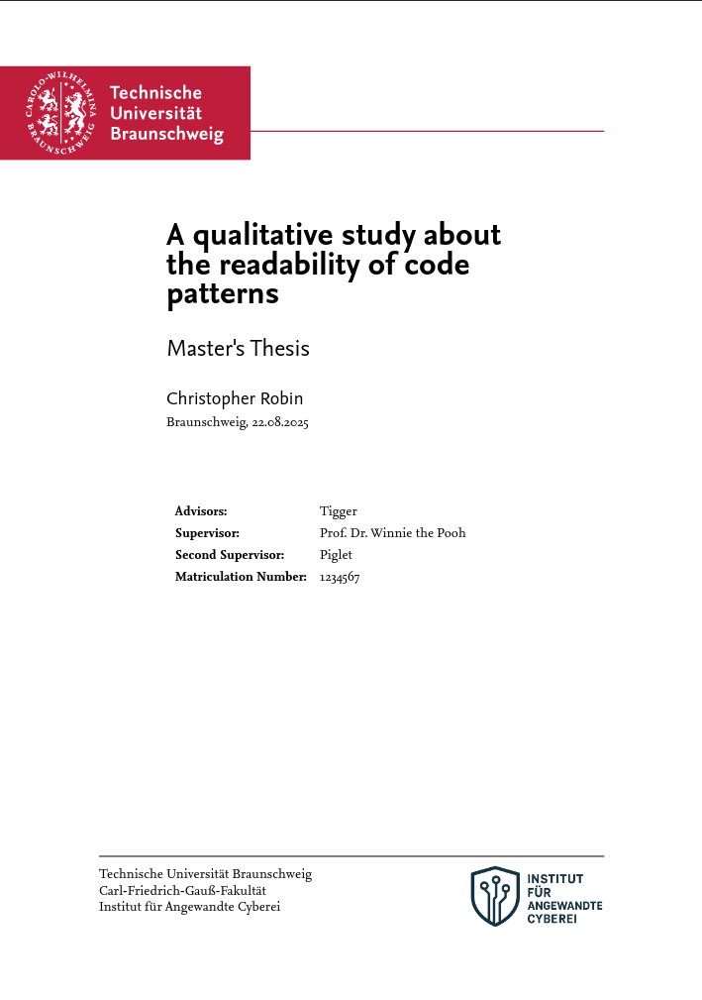

# TU Braunschweig typst thesis template

This is the [Typst](https://typst.app/) template for a thesis that adheres to the [Corporate Design der TU Braunschweig](https://www.tu-braunschweig.de/presse/corporate-design).



## Installation

First install this package as a local typst package, as described [here](https://github.com/typst/packages/blob/ddc764a5549bd20ac1bc06ce5002ae82f231f372/README.md#local-packages).

Then install the Nexus Serif and Nexus Sans fonts, which you can download from the [CD-Toolbox Downloads section](https://www.tu-braunschweig.de/presse/corporate-design/cd-toolbox/downloads).


## File structure
A possible structure of a thesis project may look like this:
```
.
├── assets                          // Images, CSV-Files, etc.
├── chapter                         // Content
│   ├── 01-Einleitung.typ
│   ├── ...
│   └── 99-Appendix.typ
├── expose.typ                      // Exposé template
├── metadata.typ                    // Metadata and template config
├── thesis.bib                      // Bibliography (e.g. generated by Zotero + Better BibTex)
└── thesis.typ                      // Thesis template
```

## Logos on the title page

Header logos are set in `metadata.typ`:
```typ
// Example 1: Use UCC logo as organisation-logo and the FIN faculty header as header-logo
#let organisation-logo = image("assets/angewandte_cyberei_institutslogo.png", width: 2cm)
#let header-logo = image("assets/TUBraunschweig_SVG_Siegel", width: 100%)

// Example 2: Do not use logos at all
#let organisation-logo = none
#let header-logo = none
```

## Contribution

Pull requests welcome!

## Authorship

This template is based on the [v411e/optimal-ovgu-thesis from Valentin Rieß](https://github.com/v411e/optimal-ovgu-thesis/).
